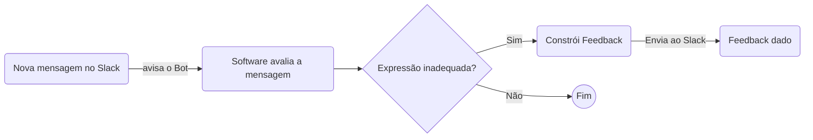

# slack-writing-feedbacks

Integração com Slack para feedbacks sobre uso de termos específicos que são inadequados no Workspace.

> Feito e constantemente atualizado pelo time Trybe com Python, Flask e 💚

# Como contribuir

## Corrigir ou melhorar o texto dos feedbacks existentes

Se você identificou um problema ou quer melhorar o texto de um feedback enviado pelo robô, [abra uma issue aqui](https://github.com/betrybe/slack-writing-feedbacks/issues) explicando a proposta de alteração. Nosso time avaliará assim que possível!

## Adicionar ou remover expressões que geram feedbacks

Como o nosso Bot é uma ferramenta para nos ajudar a termos uma comunicação mais alinhada com nossos [guias de comunicação](https://playbook.betrybe.com/docs/companhia/comunicacao/), toda proposta de novo feedback deve estar alinhada e embasada nesses materiais.

Se a expressão que deseja adicionar/remover está alinhada e embasada em nossos guias, basta [abrir uma issue aqui](https://github.com/betrybe/slack-writing-feedbacks/issues) explicando a proposta e citando a referência. Nosso time avaliará assim que possível!

Se a expressão que deseja adicionar/remover **_não_** está alinhada e embasada em nossos guias, você deve abrir uma thread de `[DISCUSSÃO]` no canal [#func-responsabilidade-governança](https://betrybe.slack.com/archives/C02TSA5E6MU) marcando [@Mariana Lopes](https://betrybe.slack.com/archives/D01QYAHALEM).

## Alterar o código da aplicação

Se você quer resolver uma issue de Bug ou Feature alterando o código da aplicação, entre em contato com [@Bux](https://betrybe.slack.com/archives/D01K3QBS4F6) para receber os devidos alinhamentos e o acesso ☺️

# Como o Bot funciona


Utilizamos a Events API do Slack para receber eventos de novas mensagens que circulam no Workspace. Mensagens que ocorrem em canais privados e públicos são notificadas ao Bot, e serão analisadas.

A análise textual é feita utilizando a [bilioteca NLTK](https://www.nltk.org/) com o complemento [dessas POS-taggers para português](https://github.com/inoueMashuu/POS-tagger-portuguese-nltk) que possibilitam distinguir alguns termos entre verbo/adjetivo/substantivo/etc, e tornar a análise mais assertiva.

Na análise de termos como "os estudantes", usamos a seguinte lógica: 
> Precisa haver a ocorrência de "estudantes" e uma das palavras que a cercam precisa (i) não ser um verbo e (ii) terminar com um marcador de plural masculino ("os", "res", "ões", "ns" ou "ãos").

Para termos como "os usuários" e "os instrutores", que já terminam com um marcador de plural masculino, a ocorrência da própria palavra já implica no feedback. Na análise de outras expressões, atualmente apenas verificamos a ocorrência da string de forma bruta.

Se identificada uma expressão inadequada, ocorre a construção da mensagem de feedback que é enviada através de uma [Ephemeral Message](https://api.slack.com/methods/chat.postEphemeral). Esse tipo de mensagem é visível apenas para a pessoa que escreveu a mensagem original, e as mensagens não são mantidas entre sessões do Slack.

## Padronização dos feedbacks

No arquivo `feedbacks.json` temos 3 pedaços de texto dentro da seção `"default_text"`, que representam a estrutura base da mensagem que o robô envia quando dá um feedback:
- `intro`: Pequena saudação marcando (`<@<user_id>>`) a pessoa que escreveu a mensagem original, citando (`<found_word>`) a expressão que foi usada indevidamente, e linkando (`<<thread_link>|aqui>`) a mensagem contendo a expressão indevida
- `explanation`: Pequeno início para o parágrafo (`<feedback>`) que explica a motivação do feedback àquela expressão.
- `goodbye`: Finalização da mensagem, com link para abertura de issue no repositório

Cada uma dessas partes da mensagem será, por padrão, separada por 1 linha em branco na mensagem final.

Para alterar esses textos, basta alterar o arquivo tendo cuidado para manter a formatação padrão do JSON. Faça suas alterações, nomeie e conclua o commit criando uma nova branch. Prossiga criando o Pull Request, e aguarde que sua sugestão seja revisada pelo time responsável.

### Relação de expressões com seus devidos feedbacks

No arquivo `feedbacks.json` temos a seção `"feedbacks"` que é a relação `expressão a ser evitada` <> `feedback para a expressão, quando usada`.

No exemplo abaixo, as expressões `denegrir`, `denegrindo` e `denegriu` terão o mesmo texto de feedback (representado por `denegrir`), e a expressão `os estudantes` terá outro texto de feedback (representado por `os_estudantes`).

```json
"feedbacks": {
    "denegrir": "denegrir",
    "denegrindo": "denegrir",
    "denegriu": "denegrir",
    "os estudantes": "os_estudantes"
}
```

Os termos `os_estudantes` e `denegrir` fazem referência aos trechos `os_estudantes` e `denegrir` dentro da seção `explanation_patterns` no mesmo arquivo, que armazenam o texto que será usado como feedback na resposta do robô.


Para alterar esses textos, você precisa:
- alterar a seção `"feedbacks"` no arquivo `feedbacks.json`, tendo cuidado para manter a formatação padrão do JSON.
- alterar / criar o trecho correspondente na seção `explanation_patterns`  

Faça suas alterações, nomeie e conclua o commit criando uma nova branch. Prossiga criando o Pull Request, e aguarde que sua sugestão seja revisada.

## Formatação de texto e emojis do Slack

Os textos nas seções `explanation_patterns` e `default_text` podem conter [formatação](https://api.slack.com/reference/surfaces/formatting):
  - Utilize * * para deixar em **Negrito**
  - Utilize _ _ para deixar em _itálico_
  - Utilize ~ ~ para riscar um <s>texto</s>
  - Utilize ` `` ` para destacar o `texto`
  - Utilize <https://www.google.com | criar um link> para [criar um link](https://www.google.com)
  - Para usar emotes, basta adicionar :nome-do-emote: ( ⚠️ Se for um emote padrão do Slack, insira o nome em inglês. Ex: `green_heart` ao invés de `coração_verde` para obter 💚)


## Como rodar localmente

### Tokens de acesso no Slack

Para que a aplicação consiga (mesmo rodando localmente) enviar mensagens para o Slack, é necessário 2 tokens de acesso: `SLACK_BOT_TOKEN` e `SLACK_SIGNING_SECRET`

Procure uma das pessoas colaboradoras do projeto para obter esses Tokens.

### Rodando sem Docker
> Requisito: Python versão 3.8 ou mais recente

Crie um ambiente virtual utilizando o módulo [venv](https://docs.python.org/pt-br/3/library/venv.html)

```bash
python3 -m venv .venv-swf
```

Ative o ambiente virtual criado

```bash
source .venv-swf/bin/activate
```

Instale as dependências

```bash
pip install -r dev-requirements
```

Para testar a função `listen_messages` (responsável por escutar as mensagens do Slack):

```bash
python3 -i app.py
 * Serving Flask app 'app' (lazy loading)
 * Environment: development
 * Debug mode: on
 * Running on http://127.0.0.1:3000/ (Press CTRL+C to quit)
 * Restarting with stat
 * Debugger is active!
 * Debugger PIN: 322-576-941
 |
```

Nesse momento o REPL (terminal interativo do Python) foi aberto. Aperte `ctrl+C` para cancelar a execução do app, mas sem sair do terminal do Python.

Você verá o indicativo `>>>` para inserir um comando do Python, e então poderá utilizar o comando abaixo. 
- Substitua `SEU_USER_ID` pelo seu [ID de usuário do Slack](https://www.workast.com/help/articles/61000165203/), entre aspas. 
- Substitua `SUA_MENSAGEM` pelo texto da mensagem que gostaria de testar, entre aspas.

```python
>>> listen_messages({'event': {'type': 'message', 'text': SUA_MENSAGEM, 'user': SEU_USER, 'thread_ts': '1633639960.411500','ts': '1633639960.411500','channel': CANAL_MENSAGEM}})
```


# EXTRA EXTRA EXTRA

- precisa usar o docker-compose
Para fazer o build: `docker-compose build web`
Para rodar os testes: `docker-compose run web python3 -m pytest -v`
Para subir a API: `docker-compose up web`
Para acessear o container da API `docker-compose run --entrypoint bash web`
